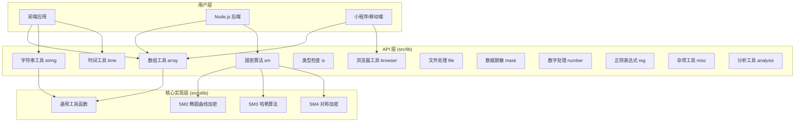
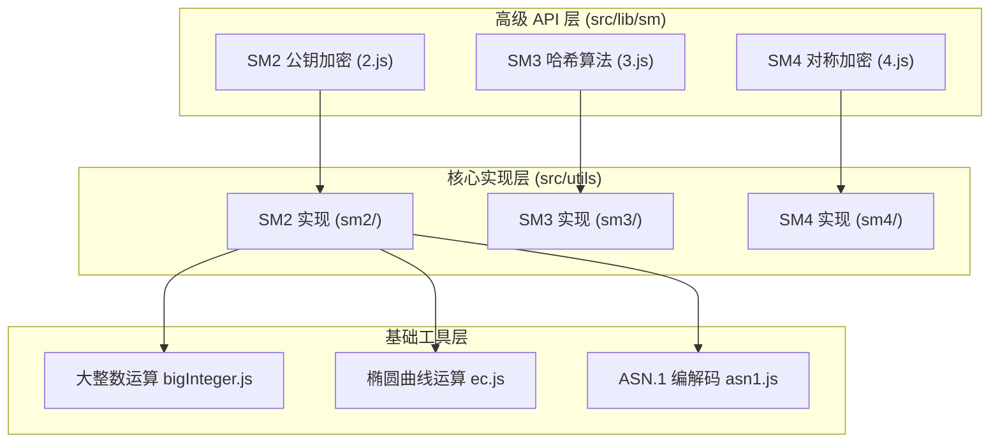
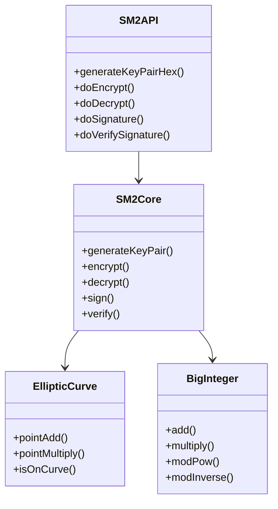
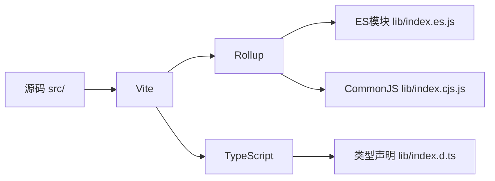
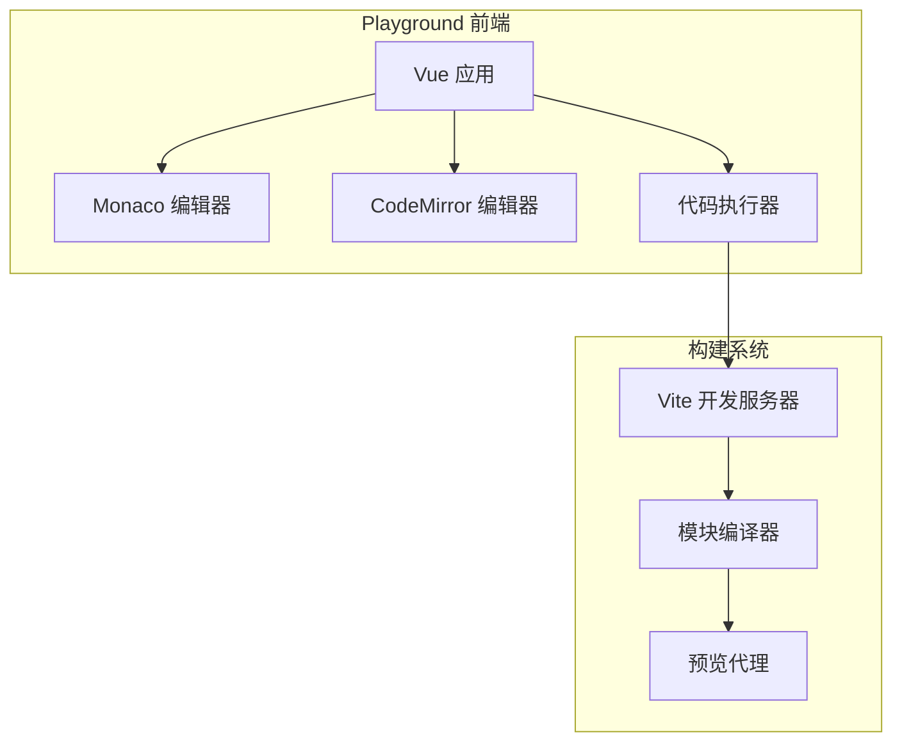

# jxk 项目架构文档

## 目录
1. [项目概述](#项目概述)
2. [整体架构](#整体架构)
3. [核心设计原则](#核心设计原则)
4. [模块化架构](#模块化架构)
5. [国密算法架构](#国密算法架构)
6. [构建系统](#构建系统)
7. [演示环境](#演示环境)
8. [扩展指南](#扩展指南)

## 项目概述

### 项目定位
**jxk** (极致、小巧、快捷) 是一个轻量级、零依赖的 JavaScript 工具函数库，旨在为开发者提供在客户端和服务器端 JavaScript 环境中常用的工具函数。

### 核心价值主张
- **零依赖设计**: 完全原生实现，无需引入任何第三方依赖
- **模块化架构**: 按功能分类组织，支持按需引入
- **国密算法支持**: 集成 SM2、SM3、SM4 国家密码标准算法
- **TypeScript 友好**: 提供完整的类型定义文件
- **高性能**: 注重运行效率和内存占用优化

## 整体架构

### 架构模式
项目采用分层模块化架构，将功能按照职责分离到不同的层次：



### 分层职责

#### 用户层
- **前端应用**: 浏览器环境的客户端应用
- **Node.js 后端**: 服务器端 JavaScript 应用
- **小程序/移动端**: 各种轻量级应用环境

#### API 层 (src/lib)
提供易用的函数式接口，每个模块负责特定领域的功能：
- 对外暴露简洁的 API
- 处理参数验证和错误处理
- 提供统一的函数签名规范

#### 核心实现层 (src/utils)
包含复杂算法的底层实现：
- 国密算法的完整实现
- 性能关键的核心算法
- 通用的辅助函数

## 核心设计原则

### 1. 单一职责原则 (SRP)
每个模块和函数都有明确的单一职责：
- 每个文件只包含一个主要功能
- 函数命名直观反映其功能
- 模块按功能域划分

### 2. 开放封闭原则 (OCP)
系统设计对扩展开放，对修改封闭：
- 通过添加新文件扩展功能
- 现有 API 保持向后兼容
- 配置驱动的灵活性

### 3. 依赖倒置原则 (DIP)
高层模块不依赖低层模块，都依赖抽象：
- API 层通过导入使用底层实现
- 算法实现与具体使用场景解耦

### 4. 最小化原则
追求最小的代码体积和运行开销：
- 函数级别的按需引入
- 避免不必要的功能冗余
- 优化算法性能

## 模块化架构

### 目录结构
```
src/
├── lib/                    # API 接口层
│   ├── analysis/          # 数据分析工具
│   │   ├── address.js     # 地址解析
│   │   ├── idcard.js      # 身份证解析
│   │   └── _meta.json     # 模块元信息
│   ├── array/             # 数组处理工具
│   │   ├── chunk.js       # 数组分块
│   │   ├── concat.js      # 数组合并
│   │   ├── unique.js      # 数组去重
│   │   ├── sort.js        # 数组排序
│   │   ├── toTree.js      # 转换为树结构
│   │   ├── fromTree.js    # 树结构展平
│   │   └── _meta.json     # 模块元信息
│   ├── browser/           # 浏览器工具
│   │   ├── copyText.js    # 文本复制
│   │   ├── getQueryParams.js # URL参数解析
│   │   ├── openFullscreen.js # 全屏控制
│   │   └── _meta.json     # 模块元信息
│   ├── file/              # 文件处理工具
│   ├── is/                # 类型检查工具
│   ├── mask/              # 数据脱敏工具
│   ├── misc/              # 杂项工具
│   ├── number/            # 数字处理工具
│   ├── reg/               # 正则表达式工具
│   ├── sm/                # 国密算法接口
│   │   ├── 2.js           # SM2 算法接口
│   │   ├── 3.js           # SM3 算法接口
│   │   ├── 4.js           # SM4 算法接口
│   │   └── _meta.json     # 模块元信息
│   ├── string/            # 字符串处理工具
│   └── time/              # 时间处理工具
├── utils/                 # 核心实现层
│   ├── sm2/               # SM2 算法实现
│   │   ├── index.js       # 主要实现
│   │   ├── bigInteger.js  # 大整数运算
│   │   ├── ec.js          # 椭圆曲线运算
│   │   ├── asn1.js        # ASN.1 编解码
│   │   └── utils.js       # 工具函数
│   ├── sm3/               # SM3 算法实现
│   │   └── index.js       # 哈希算法实现
│   ├── sm4/               # SM4 算法实现
│   │   └── index.js       # 对称加密实现
│   └── common.js          # 通用工具函数
├── index.js               # 主入口文件
└── libNames.js            # 函数名映射表
```

### 模块元信息系统
每个功能模块都包含 `_meta.json` 文件，用于描述模块信息：

```json
{
  "name": "array",
  "description": "数组处理工具函数集合",
  "version": "1.0.0",
  "author": "xkloveme",
  "functions": [
    {
      "name": "chunk",
      "description": "将数组分割为指定大小的块",
      "category": "transformation"
    }
  ]
}
```

### 自动化构建机制
通过 `generate.js` 脚本自动生成入口文件：

1. **扫描模块**: 自动扫描 `src/lib` 目录下的所有模块
2. **生成导出**: 为每个函数生成对应的导出语句
3. **创建映射**: 生成函数名到模块的映射关系
4. **更新入口**: 更新主入口文件 `src/index.js`

## 国密算法架构

### 分层设计
国密算法模块采用三层架构：



### SM2 椭圆曲线算法架构

#### 组件关系


#### 核心算法流程
1. **密钥生成**: 基于椭圆曲线参数生成公私钥对
2. **加密流程**: C1C3C2 或 C1C2C3 模式加密
3. **签名流程**: 基于 SM3 哈希的数字签名
4. **验证流程**: 椭圆曲线点验证和签名验证

### SM3 哈希算法架构

SM3 采用分组密码设计：
- **消息扩展**: 将 512 位消息块扩展为 68 个字
- **压缩函数**: 64 轮迭代压缩计算
- **输出处理**: 生成 256 位哈希值

### SM4 对称加密架构

支持多种工作模式：
- **ECB 模式**: 电子密码本模式
- **CBC 模式**: 密码块链接模式
- **填充方案**: PKCS7 填充

## 构建系统

### 构建工具链


### 构建配置
基于 Vite 的现代构建系统：

```javascript
// vite.config.js
export default {
  build: {
    lib: {
      entry: 'src/index.js',
      formats: ['es', 'cjs'],
      fileName: (format) => `index.${format === 'es' ? 'es' : 'cjs'}.js`
    },
    rollupOptions: {
      external: [],
      output: {
        exports: 'named'
      }
    }
  }
}
```

### 输出格式
支持多种模块格式：
- **ES 模块**: 现代浏览器和 Node.js
- **CommonJS**: 传统 Node.js 环境
- **TypeScript 声明**: 完整的类型支持

## 演示环境

### Playground 架构
基于 Vue + Vite 构建的在线演示环境：



### 核心特性
- **双编辑器支持**: Monaco 和 CodeMirror 可选
- **实时预览**: 代码变更即时反映
- **模块热替换**: 支持热重载开发
- **错误处理**: 完善的错误提示机制

## 扩展指南

### 添加新功能模块

#### 1. 创建模块目录
```bash
mkdir src/lib/newmodule
```

#### 2. 实现功能函数
```javascript
// src/lib/newmodule/newFunction.js
/**
 * 新功能函数描述
 * @category newmodule
 * @alias newmodule_newFunction
 * @param {any} param - 参数描述
 * @returns {any} 返回值描述
 * @author your-name
 * @example
 * newFunction(param);
 */
export default function newFunction(param) {
    // 实现逻辑
}
```

#### 3. 添加模块元信息
```json
// src/lib/newmodule/_meta.json
{
  "name": "newmodule",
  "description": "新模块描述",
  "version": "1.0.0",
  "author": "your-name"
}
```

#### 4. 运行构建
```bash
npm run gen
```

### 添加单元测试
为新函数创建对应的测试文件：

```javascript
// src/lib/newmodule/newFunction.test.js
import { describe, it, expect } from 'vitest'
import newFunction from './newFunction.js'

describe('newFunction', () => {
  it('should work correctly', () => {
    const result = newFunction('test')
    expect(result).toBe('expected')
  })
})
```

### 性能优化指南

#### 1. 算法优化
- 选择时间复杂度更低的算法
- 减少不必要的循环和递归
- 使用适当的数据结构

#### 2. 内存优化
- 避免内存泄漏
- 及时释放大对象引用
- 使用对象池技术

#### 3. 包体积优化
- 支持 Tree Shaking
- 避免引入不必要的依赖
- 使用代码分割技术

## 性能考量

### 基准测试
项目包含性能基准测试，确保关键函数的性能表现：

```javascript
// 性能测试示例
const iterations = 10000;
const start = performance.now();
for (let i = 0; i < iterations; i++) {
    sm4.encrypt(testData, key);
}
const end = performance.now();
console.log(`平均耗时: ${(end - start) / iterations}ms`);
```

### 优化策略
1. **算法优化**: 选择高效的算法实现
2. **缓存机制**: 对重复计算结果进行缓存
3. **懒加载**: 按需加载模块和功能
4. **并行处理**: 利用 Web Workers 进行并行计算

## 安全考量

### 加密算法安全
- **随机数生成**: 使用加密安全的随机数生成器
- **侧信道攻击**: 实现常数时间算法
- **密钥管理**: 提供安全的密钥生成和存储建议

### 输入验证
- **参数检查**: 严格验证输入参数
- **边界处理**: 正确处理边界值和异常情况
- **XSS 防护**: HTML 转义函数防止 XSS 攻击

## 总结

jxk 项目通过精心设计的模块化架构，实现了功能丰富、性能优秀、易于扩展的 JavaScript 工具函数库。其分层设计、自动化构建和完善的文档系统，为开发者提供了优秀的使用体验和二次开发基础。

国密算法的集成使得项目在安全性方面具有独特优势，特别适合需要符合中国密码标准的应用场景。通过持续的性能优化和安全加固，jxk 项目将继续为 JavaScript 生态系统提供价值。